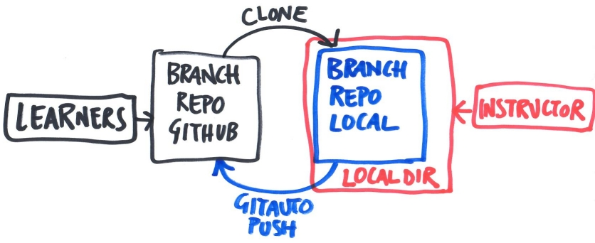

# A repository for workshop notes
## Automated note-taking for the Carpentries workshops using gitautopush

**Current branch** You are in the master branch.

**Readership** Workshop coordinators and instructors.

**Document status** This document is a draft. Please open issues to provide remarks.


---

## 1. Context

**The lesson notes** are the documents containing the commands the instructors type along during a lesson. 
Instructors may not follow the lesson material of the Carpentries website verbatim.

**The ambition** is to use this repository to share and store the notes of all lessons of all editions of all Carpentries workshops held at the 4TU.ResearchData. 

**The need** _Learners_ use the lesson notes to catch up with a backlog of instructions when they had to lag behind, for example after receiving a helper's support with an issue. Or as written reference after the workshop. 
Previously, one helper was fully engaged with the task of note-taking. 
The application to the Python lesson by [Maurits Kok (@mwakok)](https://github.com/mwakok) at https://github.com/mwakok/software_carpentry_learner has showed that note-taking can be automated effectively.

**The key tool** is `gitautopush`, an application that _detects_ changes in the working directory, _commits_ them to a local repository, and _pushes_ them to the associated remote repository automatically (and uncritically and verbosely too). 
The _local repository_ in the instructor's machine must contain the files to be shared while the instructor keeps on typing. 
(The local repository _performs_ the pushes.) 
The learners can consult the notes in the auto-pushed _remote repository_. 
(The remote _receives_ the pushes.) 
`gitautopush` has indeed been conceived from the start to support the Software Carpentries. 
This application is available from the Python Package Index at https://pypi.org/project/gitautopush/ (accessed 19 May 2023); more on its installation in §3.2.  
This diagram displays the way this arrangement is supposed to work:   


**This document** explains to instructors how to use this remote to serve each edition of a Carpentries workshop and how to prepare your local computer for this. 
As of May 2023, it only comments on the lessons of the Software Carpentry Workshop (SCW): Git, Unix Shell, and Python.
Each lesson fills the working directory and repositories differently. 
The table below organises how the working directory is used in each unassisted lesson:

| Lesson | Contains a repo? | Commands are typed in...| We share... | Notes contain... | Duration in half-days | 
|:-------|:------|:------|:------|:------|:------|
| Git | yes | Shell terminal | Shell command history | input | 1 |
| Python | no | Browser | Jupyter notebook | in/output | 2 |
| Unix Shell | no | Shell terminal | Shell command history | input | 1 |

---

## 2. Organizing information for automated note-sharing 

### 2.1 Using branches for workshop editions

Using this repository for automated note-taking/sharing requires that:

1. the _master branch_ only provides instructions to _coordinators/instructors_;
2. this README in the _master branch_ thus addresses _coordinators/instructors_;
3. workshop _editions_ are tied to specific _branches_;
4. the _lesson notes_ are files tracked by and committed to an _edition branch_; 
5. the README of the _edition branch_ thus addresses the workshop _learners_.

### 2.2 Name conventions
To leverage speed reading and finding, the following usage is encouraged:

1. **edition-specific branch names** follow the pattern \[yymm\]-\[type of workshop\]-\[institution\]. 
 Example: Software Carpentry Workshop in May 2023 at Delft => `2305-SCW-TUD`.
2. **shared-file names** start with the lesson they belong to, as follows: 
   - `python*`. For example, Python shares JupyterLab notebooks and runs in two sessions. Hence: `python1.ipynb`, `python2.ipynb` 
   - `unixshell*`, `git*`. For example, Unix Shell and Git both share the command history and run in one session each. Hence: `unixshell.log`, `git.log`. 

The table is an example of the eventual data hierarchy:

| Content | Name | Name format |
|:-------|:------|:------|
| this GitHub account | `4TUResearchData-Carpentries` | -- |
| this (remote) repository | `workshop_notes` | -- |
| an edition branch | `2305-SWC-TUD` | \[yymm\]-\[type of workshop\]-\[institution\] |
| lesson notes in the edition branch | `git.log` | `git*` |
| lesson notes in the edition branch | `python1.ipynb` | `python*` |
| lesson notes in the edition branch | `python2.ipynb` | `python*` |
| lesson notes in the edition branch | `unixshell.log` | `unixshell*` |

### 2.3 Other usages

1. File extensions may vary. 
It is important for proper visualisation in GitHub that human-readable files have extensions typically recognized as such, like `*.log` or `*.txt`. 
2. You may share more files than the notes, of course, provided their name is prepended with the originating lesson name, as said just above.
3. In principle, one can also use directories to organise contents according to the lessons. 
However, a flat list of files is leaner and discourages sharing in bulks. 

Concerning items 2 and 3, please be considerate that, if this pilot takes off, this repository is expected to contain the materials of many workshop editions. 
The leaner from the outset, the better for the instructors' information management and the learners' ['extraneous load'](https://en.wikipedia.org/wiki/Cognitive_load).


---

## 3. Preparations for coordinators/instructors

### 3.1 Data

#### 3.1.1 The remote 'edition branch' 

A workshop coordinator can undertake these actions. 
You do not need to be an instructor to set this up.

##### Where and when
As for the where, in this repository on GitHub. Its URL is https://github.com/4TUResearchData-Carpentries/workshop_notes. 

As for the when, after the workshop edition has been planned and the links to the Carpentries workshop site and to the collaboration document are known. 

##### What and how
The table details the steps to prepare the edition branch on this GitHub remote repository.

|Step |Objective |Action |Example
|:-------|:------|:------|:-----|
|1 | create empty edition branch | [create a new branch in this repo](https://github.com/4TUResearchData-Carpentries/workshop_notes/branches) following §2.2 | [`2305-SCW-TUD`](https://github.com/4TUResearchData-Carpentries/workshop_notes/tree/2305-SCW-TUD) |
|2 | customize README for learners | edit workshop type, days, host and links (*) | [README of 2305-SWC-TUD](https://github.com/4TUResearchData-Carpentries/workshop_notes/blob/2305-SCW-TUD/README.md) (Software, 22-25 May 2023, Delft University of Technology, ...)|
|3 | broadcast URL of edition branch | update collaboration document for learners | In the [workshop collaborative document](https://docs.google.com/document/d/1s_LVZVKFA908kGex2wI4Ce-ZF8CqQLfD8S2kDRClL0g/edit#) sections on type-along commands point to the URL of the edition branch https://github.com/4TUResearchData-Carpentries/workshop_notes/tree/2305-SCW-TUD |

#### 3.1.2 The local repository and edition branch

Instructors must undertake these actions. 
Specific notes of caution apply as to which lessons you are teaching.

##### Where and when

As for the when, after the edition branch is ready in this remote (§3.1.1).

As for the where, in the machine the instructor will use for giving the lesson.
You need to make a conditioned choice regarding the paths of:
 
* the **working directory** (path WORKINGDIR). 
This is where you carry out the demonstrations for the learners. 
Typically, this is a subdirectory of the desktop, although the instructor is free to choose any of his/her liking. 
You show the learners a terminal working on this directory.
* the **auto-pushing directory** (path AUTOPUSHDIR).
This where you save your lesson notes (whether notebooks or command histories) AND clone (the edition branch of) this repository AND have `gitautopush` observe the local changes (another terminal is thus needed for launching `gitautopush`, §3.2).
You do _not_ show the learners the terminal working with this directory.

The table below guides the choice of the AUTOPUSHDIR directory for the different lessons:

| Questions | Unix Shell | Git | Python |
|------:|:------|:------|:------|
| **Will AUTOPUSHDIR = $WORKINGDIR work?** | No. Create another directory unrelated to WORKINGDIR. |No. Same as Unix Shell. | Yes. And it should be so in a [KISS](https://en.wikipedia.org/wiki/KISS_principle) approach. |
| **Why?** | You are showing the learners the terminal with WORKINGDIR. gitautopush is verbose and its messages pollute that terminal at any change of the directory content, that is any command you type. (You may wish to check the gitautopush output from time to time.) | See Unix Shell. Also, you need a Git repository which you have full control on, whereas gitautopush will uncritically commit any change of the directory content and try to push it. Let alone that it is unhandy to manage two repositories in one directory. | You are working on the browser and never share a terminal with the learners. The verbose standard output of gitautopush does not interfere with your demonstration in the notebook. |
| **What to do in AUTOPUSHDIR?** | Redirecting the command history to a file contained there. See next section. | Same as Unix Shell. See next section. | A `.gitignore` file that does not track a notebook's hidden companions, like the directory `.ipynb_checkpoints` (plus any notebook output you do not need to share). See next subsection. |
| **How many terminals are needed?** | 1 for gitautopush + 2 | 1 for gitautopush + 2 | 1 for gitautopush |


##### What and how 

Once you set your WORKINGDIR and AUTOPUSHDIR as convenient and appropriate, clone the remote edition branch (§ 3.1.1) into AUTOPUSHDIR. Conveniently, the following command enables you to clone the edition branch only. (Source: [Git documentation](https://www.git-scm.com/docs/git-clone) and [Stackexchange Q&A](https://stackoverflow.com/a/9920956), accessed 19 May 2023). Please set or substitute the variables AUTOPUSHDIR and EDITIONBRANCH (for the edition branch name, for example `SWC-2305-TUD`).

```bash
 mkdir $AUTOPUSHDIR
 git clone git@github.com:4TUResearchData-Carpentries/workshop_notes.git --branch $EDITIONBRANCH --single-branch $AUTOPUSHDIR
```
Recall that `git clone` wants to act on an empty (AUTOPUSHDIR) directory.

For the **Unix Shell** and **Git** lessons, use 

1. A terminal to type along your commands. You start off in WORKINGDIR. This terminal shows both input and output. You always share this with the learners.
 There you type ahead of the start of the lesson: 
 
 ```bash
 export PROMPT_COMMAND="history -a; $PROMPT_COMMAND"
 ```
2. Another terminal showing the history of commands typed. This terminal shows only input. 
 There you type ahead of the start of the lesson: 
 
 ```bash
 clear
 tail -n 0 -f ~/.bash_history | tee -a $WORKINGDIR/$LESSON.log
 ```
where `LESSON = [ git | unixshell ]` according to the name convention for the notes file presented in §2.2. 
  You may or may not share this terminal with the learners alongside the first (if feasible, it is helpful). The `tee` command above generates the lesson notes upon piping to the notes file the command history displayed on this terminal.


You close both terminals after closing the lesson.

For the **Python** lesson, create a `.gitignore` file (keep single quotes!):

 ```bash
 cd $AUTOPUSHDIR
 echo '.ipynb_checkpoints' > .gitignore
 echo '*code' >> .gitignore
 echo '*data' >> .gitignore
 echo '.gitignore' >> .gitignore
 ``` 
The aim is to avoid that the service directory of JupyterLab and the supporting lesson materials burden the remote repository of the lesson notes, especially in the long run. 
The last line is not the orthodox fashion: it works but see `git help gitignore` for cleaner ways to implement the same effect.

### 3.2 Software (gitautopush)

#### The package

Description, credits, licenses and downloads of gitautopush are available from the Python Package Index at https://pypi.org/project/gitautopush/ (accessed 19 May 2023). 

#### Install 

In a terminal launch

 pip install gitautopush

#### Help

Get familiar with the options and arguments with: 

 gitautopush -h

#### Supporting software

gitautopush makes continual usage of an SSH connection with GitHub.  
See https://docs.github.com/en/authentication/connecting-to-github-with-ssh for directions.  
To this end gitautopush requires that...

```bash
# TODO: explanation of commands
```
You do this only once per machine.

#### Launch

At the start of the lesson open a new terminal and launch

 gitautopush --sleep <seconds> $AUTOPUSHDIR

The option `sleep` sets how frequently gitautopush observes whether changes took place in AUTOPUSHDIR. 
It seems reasonable that values in the range of 2-5 seconds are short enough to follow the instructor's typing closely.

Alternatively, one can also launch gitautopush this way:

 ```bash
 cd $AUTOPUSHDIR
 gitautopush --sleep <seconds> .
 ```

Close this auto-pushing terminal when the lesson is over.

#### Forewarned is forearmed

For the **Python** lesson, take note that the default interval for autosaving in **JupyterLab** is 120 seconds.  
For gitautopush to observe a change, the instructors can either take care of saving their work manually and regularly (with `Ctrl+S`) or reduce the autosave interval to 2-5 seconds. 
This can be done with the Advanced Settings Editor (with `Ctrl+,`) and then searching for the keyword "autosave".  
Please verify if the interval set through the attending web interface is effectively implemented.
If not, it can be preferable and more robust to customize the parameter `autosaveInterval` at the lower level of the 'Document Manager settings' using the 'JSON Settings Editor'. 
This other avenue is described [in this blog](https://www.webucator.com/article/change-default-autosave-interval-in-jupyterlab/), accessed on 19 May 2023. 

-----

## Helpful resources to compose this document

* https://docs.github.com/en/get-started/writing-on-github/
